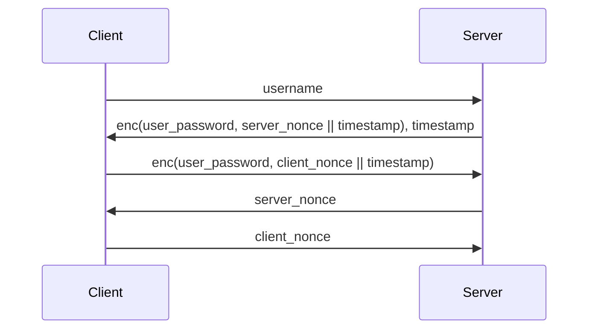

# ExCCel

| Service     | ExCCel                                                                                                      |
| :---------- | :---------------------------------------------------------------------------------------------------------- |
| Authors     | Gianluca Altomani <@devgianlu>, Vincenzo Bonforte <@Bonfee>, Giulia Martino <@Giulia>, Matteo Rossi <@mr96> |
| Stores      | 2                                                                                                           |
| Categories  | pwn, crypto                                                                                                 |
| Port        | HTTP 8000                                                                                                   |
| FlagIds     | store1: [worksheet ids], store2: [worksheet ids, owner names]                                               |
| Checkers    | [store1](/checkers/ExCCel-1/checker.py), [store2](/checkers/ExCCel-2/checker.py)                            |

## Description
This service lets you create worksheets, whose cells can contain formulas. A Python webserver handles the frontend and formula parsing, converting each formula from text to a custom VM bytecode. A C binary executes the VM bytecode. The website handles registration and login of users. worksheets can be either sharable or not. You can only view your own worksheets or the ones shared with you. An additional feature allows you to insert comments in the cells of a worksheet that you own or has been shared with you. Flags are placed by the bot in a worksheet cell for the first flagstore, while they are in a comment of a random cell for the second one.

## Vulnerabilities

### Store 1 (pwn):
The first flagstore is accessible through vulnerability in the C virtual machine. The C binary only communicates with the service backend (i.e., it is not exposed on the internet) and it implements a virtual machine which handles different cell operations:
- arithmetics (add, sub, mul, ...)
- string operations (concat, join, trim, upper, ...)

The virtual machine works as a stack machine, with no registers. Immediates are passed to the VM using a separate blob of data, and code contains references to it. Code can also contain references of cells in a worksheet, and ranges of cells.

When the program starts, the binary reads different fields from input:
- the id of the worksheet it needs to load
- the timestamp of the operation (timestamps older or newer than 60s are not accepted)
- the code to execute
- the immediates blob

#### Vuln 1: BOF on timestamp string variable
The program takes the timestamp as an input coming from the backend. It takes it as a string, and then it parses it into a long to compare it to the current timestamp:

```c
    // ...
    unsigned char timestamp_sz;
    char timestamp_str[32];
    // ...
    read_exactly(0, &timestamp_sz, sizeof(timestamp_sz));
    // ...
    read_exactly(0, &timestamp_str, timestamp_sz);
    // ...
```
The `timestamp_str` buffer is only 32 bytes long, but the program blindly trusts the `timestamp_sz` read from the backend and uses it as a parameter for `read_exactly`. The timestamp is passed to the backend as a POST parameter, so it is fully controlled by the attacker.

Using the BOF, an attacker can overflow into the `worksheet_id` local variable. By changing the id, it is possible to load an arbitrary worksheet. So the attacker can just choose a worksheet containing a flag.

By setting `A1=CONCAT(B1:BL1, A2:BL64)` it’s possible to concatenate all the contents of all the other cells into `A1`, and leak the flag (unless the flag it’s in `A1` itself; in this case, use another cell).

#### Vuln 2: BOF in JOIN operation
The JOIN operation works exactly like concat, but cell values are separated by a comma when concatenated togheter. The code correctly checks that the sum of the contents of the JOIN-ed cells does not exceed the maximum size of a cell. However, the code does not take into account the commas while computing the resulting len.

An attacker can use a formula like `=JOIN(C1:C64, A1)`, with the range `C1:C64` being only empty cells and `A1` containing 64 chars. The size check will pass, being the sum of the contents 64 bytes long, but each contatenation adds a comma, which makes the final string being 64 bytes more than the maximum allowed size.

```c
void handle_join(unsigned short n_params) {
    value_t res;
    value_t *arg = NULL;
    unsigned char len = 0;

    memset(&res, 0, sizeof(res));

    arg = calloc(n_params, sizeof(value_t));

    for (int i = 0; i < n_params; i++) {
        pop_val(&arg[i]);
        len += arg[i].data.raw.len;
        if (len > sizeof(res.data.raw.data))
            error("concat: result is too big");
    }

    for (int i = 0; i < n_params; i++) {                // [1]
        memcpy(res.data.raw.data + res.data.raw.len, arg[i].data.raw.data, arg[i].data.raw.len);
        res.data.raw.len += arg[i].data.raw.len;        // [2]
        if (i < n_params - 1)
            res.data.raw.data[res.data.raw.len++] = ',';
    }

    push_val(&res);
}
```

The 64 chars contained in `A1` will then overflow the `value_t res` variable stored on the `handle_join` stack.

Before reaching the return address the overflow will corrupt:
- The value_t *arg
- The i index used both at [1] and [2]

These two variables need to be fixed so that the program does not crash right after the `memcpy` and exits the loop. Set `arg` to an arbitrary readable address and `i` to something >= n_params

With the overflow it is possible to craft a 3-QWORD long ropchain. A couple of useful gadget are provided in the binary to make the exploitation easier. A possible strategy:
- pop registers + stack pivot on a worksheet cell
- write a `open`-`read`-`success` ROP on the cell

### Store 2 (crypto):

As mentioned before, in this second flagstore flags are stored in comments. Comments are stored in the database and can not be accessed from the processor, which means that we have to exploit something in the Python backend to find our flags.

Moreover, differently from the first store, in this case we also know the username of the owner of the worksheet with the flag and the worksheets containing the flags are set to sharable.

The two obvious attack vectors are:
- logging in as the owner of the worksheet
- share somehow the worksheet with an account that we control

These two parts are exactly where the intended vulnerabilities live.

#### Vuln 1: Login bypass

Let's analyze the login protocol:



If the client verifies that the `server_nonce` is correct, the client authenticates the server. If the server verifies that the `client_nonce` is correct, the client is allowed to login. One trivial way to bypass the login system could be replaying directly the nonce used by the server but, fortunately, this is checked in the server code.

Let's go deeper in how the encryption works:

```python
def generate_login_token(passwd: str, timestamp: int) -> tuple[bytes, bytes]:
    nonce = os.urandom(24)
    data = nonce + timestamp.to_bytes(8, 'little')

    iv = os.urandom(16)
    encryptor = Cipher(algorithms.AES256(derive_key(passwd)), modes.CBC(iv)).encryptor()
    ct = encryptor.update(data) + encryptor.finalize()
    return nonce, iv + ct


def verify_login_token(passwd: str, timestamp: int, token: bytes, nonce: bytes):
    decryptor = Cipher(algorithms.AES256(derive_key(passwd)), modes.CBC(token[:16])).decryptor()
    data = decryptor.update(token[16:]) + decryptor.finalize()

    return data[:24] == nonce and data[24:32] == timestamp.to_bytes(8, 'little')
```

The `generate_login_token` function encrypts the token with CBC, that is known to be malleable. We can apply a standard bitflip attack on AES-CBC to control the token: flipping a bit in the (random) IV used by the server is enough to have a bit flipped in the first 16 bytes of the nonce. As we fully control this flip, it is easy to retrieve also the correct value of the nonce to send to the server, by applying the same flip to the nonce value. Full exploit [here](/exploit/ExCCel/ExCCel-2-craft-login-token.py).

*Patching*

To patch this vulnerability we need to check that both parts of the nonce (the one in the first block of encrypted token, and the one in the second one) are different from client to server. The check implemented in the service is in `app.py`, in the `login_third` function and works like this:

```python
if (not verify_login_token(user.password, timestamp, bytes.fromhex(client_token), bytes.fromhex(client_nonce))
        or server_nonce == client_nonce):
    return make_error_response(401, 'Client verification failed')
```

To patch it, we need to replace the `server_nonce == client_nonce` with `(server_nonce[:16] == client_nonce[:16] or server_nonce[16:] == client_nonce[16:])`, as the attacker can not have a controlled bitflip in the second part of the nonce while keeping the knowledge of the value of the first part.

#### Vuln 2: Crafting sharing tokens

As we mentioned before, the second vulnerability lies in the sharing tokens. Let's analyze the code from `sharing.py`.

```python
def derive_key(worksheet: Worksheet) -> bytes:
    kdf = KBKDFHMAC(
        algorithm=hashes.MD5(),
        mode=Mode.CounterMode,
        length=32, rlen=4, llen=4,
        location=CounterLocation.BeforeFixed,
        label=None, context=None, fixed=None
    )
    return kdf.derive(bytes.fromhex(worksheet.private_id))

def verify_invite_token(worksheet: Worksheet, token: str) -> bool:
    f = Fernet(base64.urlsafe_b64encode(derive_key(worksheet)))

    try:
        return f.decrypt(token.encode()).hex() == worksheet.public_id
    except:
        return False

def generate_invite_token(worksheet: Worksheet) -> str:
    f = Fernet(base64.urlsafe_b64encode(derive_key(worksheet)))
    return f.encrypt(bytes.fromhex(worksheet.public_id)).decode()
```

Sharing tokens are encrypted and signed using, as key, something derived from the worksheet `private_id` through the `KBKDFHMAC` function. The plaintext that is encrypted and signed is the worksheet `public_id`. First of all, what are these two ids? From `app.py`:

```python
worksheet_private_id = os.urandom(128)
digest = hashes.Hash(hashes.MD5())
digest.update(worksheet_private_id)
worksheet_public_id = digest.finalize()
```

When are they used? Again from `app.py`:

```python
@app.route('/api/worksheet/<worksheet_id>', methods=['GET'])
@require_authentication
def get_worksheet(worksheet_id: str):
    worksheet = db.session.execute(db.select(Worksheet).filter_by(public_id=worksheet_id)).scalar_one_or_none()
```

Summarizing: the `public_id` is what we see in the URL when we retrieve a worksheet, and we know it from flag ids. The `private_id` is kept secret and only used to craft sharing tokens. 

Let's analyze now this `KBKDFHMAC` function.

Reading [the source code](https://github.com/pyca/cryptography/blob/main/src/cryptography/hazmat/primitives/kdf/kbkdf.py) we can notice that a "deriver" is called in this function, as follows:

```python
    ...
    self._deriver = _KBKDFDeriver(
        self._prf,
        mode,
        length,
        rlen,
        llen,
        location,
        break_location,
        label,
        context,
        fixed,
    )

def _prf(self, key_material: bytes) -> hmac.HMAC:
    return hmac.HMAC(key_material, self._algorithm)
```

Inside the deriver, this code is executed to retrieve our output:

```python
for i in range(1, rounds + 1):
    h = self._prf(key_material)

    counter = utils.int_to_bytes(i, self._rlen)
    input_data = data_before_ctr + counter + data_after_ctr

    h.update(input_data)

    output.append(h.finalize())

return b"".join(output)[: self._length]
```

Seems good, right? Not exactly. Let's ask our friend [Wikipedia](https://en.wikipedia.org/wiki/HMAC) how `HMAC` works. In `HMAC`, if the key material is longer than the block size of the underlying hash function, it is hashed before all the computations. This is exactly our case! The `private_id` is 128 bytes long, that is way more than the `MD5` digest length. Therefore, this id is hashed at the beginning in each `self._prf(key_material)`. But we kno2 the hashed `private_id`, as it is the `public_id`! We can then directly sign tokens locally using the `public_id` instead of the private one, as in every call to `self._prf(key_material)` this is done automatically if the length of the key is too big. Full exploit [here](/exploit/ExCCel/ExCCel-2-sharing-token.py).

*Patching*

This vulnerability can be patched by reducing the length of the `private_id` below the length of an `MD5` digest.

## Exploits

| Store | Exploit                                                                                      |
| :---: | :------------------------------------------------------------------------------------------- |
|   1   | [ExCCel-1-worksheet-id-overwrite.py](/exploits/ExCCel/ExCCel-1-worksheet-id-overwrite.py)     |
|   1   | [ExCCel-1-join-rce.py](/exploits/ExCCel/ExCCel-1-join-rce.py)                                 |
|   2   | [ExCCel-2-craft-login-token.py](/exploits/ExCCel/ExCCel-2-craft-login-token.py)               |
|   2   | [ExCCel-2-sharing-token.py](/exploits/ExCCel/ExCCel-2-sharing-token.py)                       |
